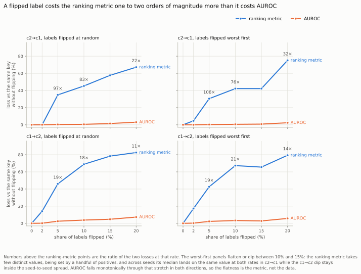
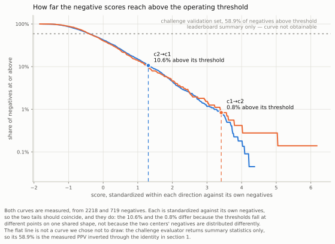

# Evaluation protocol

## The question

Which comparisons in this project are trustworthy, and on what basis? The dataset has
158 positive images across two centers. At that size most differences are not
resolvable, so the protocol has to be able to say "we could not tell" as often as it says
anything else.

## How it was measured

Every comparison runs twice: train on center 1 and evaluate on center 2, then swap. A
result in one direction is never adopted.

Differences are estimated by a paired bootstrap. Cases are resampled within patient groups
and both classes are resampled. Two configurations are compared on the same resample, so
the shared variance cancels.

Consecutive frames of one examination are near duplicates. `src/grouping.py` groups them
using mutual nearest neighbors with a cross-center constraint, before any split is made,
so that one examination cannot appear on both sides.

Two read-outs are always reported together: AUROC and the ranking metric, which is
positive predictive value at 90% recall with prevalence fixed at 1%.

Reporting both is not caution for its own sake. Flipping a share of the training labels
and re-measuring shows the two keys responding on entirely different scales to the same
damage: at 5% of labels flipped the ranking metric loses between 30% and 46% of its value
while AUROC loses between 0.3% and 2.5% of its own, a ratio between 19 and 106 depending
on the direction and the flip model. Label noise moves the operating threshold without
reordering much, and AUROC is the read-out least able to see that. A comparison judged on
AUROC alone would call this damage negligible.

<picture>
  <source media="(prefers-color-scheme: dark)" srcset="figures/labelnoise_dark.svg">
  
</picture>

The four panels are the two cross-center directions crossed with the two flip models,
because the range quoted above is measured across all four and no single pair of curves
supports it. Drawn by `tools/make_figures.py` from `p16_labelflip.json`.

## The decision rule

Written before each grid was run, and dated. The rule assigns one of seven classes from the
two directions taken together.

| Class | Meaning | Condition |
|---|---|---|
| A+ | established (improvement) | Both directions detectable and positive, and both at or above the threshold |
| A- | established (degradation) | Both directions detectable and negative, and both at or above the threshold |
| B+ | directional, below practical threshold | Both directions detectable and positive, at least one below the threshold |
| B- | directional, below practical threshold | Both directions detectable and negative, at least one below the threshold |
| C | ruled out | Both intervals lie wholly inside the threshold band |
| D | tested, not detected | Anything else |
| E | direction conflict | Directions disagree in sign, at least one detectable and large |

Threshold: |delta AUROC| of 0.0165, measured from a power curve on this data. Detectable means the paired bootstrap interval excludes zero.

Two details carry most of the weight. The classifier requires the two directions to agree
in sign, not merely to be detectable; without that constraint it labels reliably worse
configurations as established. And the threshold, 0.0165 on the AUROC scale, comes
from a power curve measured on this data rather than from convention.

We never take the best cell of a grid. The reason is measured: in one strictly nested
search the inner loop enumerated 120 configurations per backbone per
direction and kept the best, and an outer fold that the inner loop never saw reported
9 of 22 paired cells as detectably worse against
1 better. The maximum of N noisy estimates is inflated by about sigma
times the square root of 2 ln N, which is 3.1 sigma at N =
120.

## What this buys

Comparisons that survive both directions with agreeing signs are the only ones this report
states as findings. Everything else is reported as measured but not resolved, which is a
different statement from "no effect" and is kept distinct throughout.

## What it does not buy

The protocol controls selection and sampling noise. It says nothing about the difference
between the distribution we sample and the distribution the challenge evaluates on. Both
of our centers are Dutch, retrospective, and acquired without a standardized protocol; the
evaluation cohorts span twelve centers and include prospectively acquired images. No amount
of internal rigor reaches across that gap. See `04_external_validation.md`.

How wide that gap is can be stated on one axis and only one. Above our own operating
threshold sit 10.6% of the negatives training on center 2 and 0.8% training on center 1;
the challenge's own validation set implies 58.9%. That last figure is a single number and
has to stay one: the evaluator returns summary statistics, never per-image scores, so
there is no distribution behind it to draw. The figure below shows the two curves we can
measure and marks the challenge's share as a flat line, because drawing a fitted curve
there would put a model beside two measurements with nothing to tell them apart.

One thing has to be read with the figure. Each direction's scores are standardized against
that direction's own negatives, so the two tails should coincide, and they do. The 10.6%
and the 0.8% therefore differ because the thresholds fall at different points on one
shared shape, not because the negatives of the two centers are distributed differently.

<picture>
  <source media="(prefers-color-scheme: dark)" srcset="figures/negtail_dark.svg">
  
</picture>

Drawn by `tools/make_figures.py` from `p39_negative_tail.json`, which stores the curves on
a fixed grid of aggregate shares and no per-image value.

It also says nothing about the key the verdict letters are not written on. The practical
threshold, and therefore every letter counted in `07_verdict_counts.md`, is defined on the
AUROC scale. A comparison can be ruled out on that scale and still move the ranking metric
by more than its own value. The report shows this in the direction that favors us: the
change we adopted falls one percent short of the AUROC threshold while multiplying the
ranking metric by five. A later experiment, run after submission, shows the same
disagreement in the direction that does not favor us. Equal-weight multi-scale pooling
moves AUROC by -0.0048 training on center 1, which is not detectable, while the ranking
metric falls from 0.5214 to 0.1612, a drop of 69 percent, and specificity at 90 percent
sensitivity falls from 0.9917 to 0.9527. Two further variants, bilinear and bicubic
subdivision of the position grid, have positive AUROC point estimates in that same
direction and lose about a third of the ranking metric. The ranking metric cannot referee
any of this: all six of its paired intervals contain zero, and the baseline's own interval
is 0.1199 to 0.7657. Specificity at 90% recall in that direction is set by six false
positives out of 719 negatives, so one image is worth 0.0014 of it. The read-outs are in
`p38_grid_subdivision.json`.

Read the letters accordingly. `C` means ruled out on the AUROC scale at the registered
threshold. On the ranking metric the same comparisons establish nothing and rule out
nothing. Neither key is the safe one: the AUROC scale hides threshold damage, and the
ranking metric is too noisy to see it. The one finding this report advances as a
conclusion clears both keys; the letters that rule things out are written on one key
alone.
