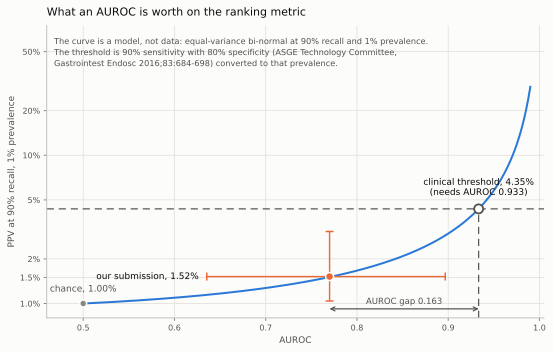

# What accounts for the gap between our evaluation and the challenge's

Supplementary to the RARE26 method report. Everything here is produced by scripts in
this repository's history; the summary in the report is one sentence pointing at this
file.

## The gap

The same container and the same weights, scored on data we never see:

| | PPV@90R (1%) [95% CI] | spec@90 | AUROC [95% CI] |
|---|---|---|---|
| Our cross-center, train c2 | 0.0787 | 0.894 | 0.9605 |
| Our cross-center, train c1 | 0.5214 | 0.992 | 0.9883 |
| RARE26 validation | 0.0152 [0.0104, 0.0306] | 0.411 | 0.7700 [0.6354, 0.8968] |
| RARE25 validation | 0.0151 [0.0106, 0.0345] | 0.407 | 0.8430 [0.7121, 0.9621] |
| Random ranking | 0.0100 | 0.100 | 0.5000 |

The pipeline is not at fault. Under an equal-variance bi-normal model an AUROC of
0.7700 implies specificity@90 of 0.4065 and PPV of 0.0151; the observed values are
0.4110 and 0.0152. A scrambled output order or an inverted label convention would put
AUROC near 0.5 instead.

One caveat on that check: it closes for RARE26 but not for RARE25, where an AUROC of
0.8430 predicts a PPV of 0.0201 against 0.0151 observed. On RARE25 the extra AUROC sits
entirely in the easy region and the high-sensitivity tail is no better.

Plotting the same model against the same measurement shows what the closure is worth and
what it is not. Our leaderboard point sits on the curve, but it arrives with a 95%
interval on each axis, and both are wide: AUROC 0.6354 to 0.8968, the ranking metric
0.0104 to 0.0306. The clinical target, 90% sensitivity with 80% specificity converted to
1% prevalence, is 4.35%, and reaching it on this curve takes an AUROC of 0.933. The upper
end of our interval is 0.8968. The conclusion that we are short of the clinical threshold
does not depend on where in that interval the truth lies.

<picture>
  <source media="(prefers-color-scheme: dark)" srcset="figures/auroc_ppv_dark.svg">
  
</picture>

Three readings from that figure, kept here rather than inside it because text drawn as a
vector path cannot be selected, searched, or read aloud. At the measured AUROC of 0.77 the
model returns 0.0151 against the 0.0152 the leaderboard reports, which is the closure
described above seen on the curve rather than in the table. The gap from our point to the
AUROC the clinical threshold needs is 0.163. And the upper end of our AUROC interval,
0.8968, is still below the 0.933 the threshold needs, so the shortfall does not depend on
where in the interval the truth lies.

The curve is a model and the caption says so; the point is measured on both axes. Drawn by
`tools/make_figures.py`, which stops rather than draw if the model disagrees with the
table above, and reads the point and its intervals from `p31_platform_leaderboard.json`.

## Method

We simulated the acquisition differences we can reproduce and applied them to the
held-out center only, in both cross-center directions, under the protocol used
throughout the report. Three axes:

* **color and illumination**: white balance (R up, B down), gamma, overall gain
* **structure enhancement**: unsharp masking, the standard model of an endoscope
  processor's enhancement setting
* **compression**: JPEG round-trip at decreasing quality

Strength is swept from 0 to a level far beyond anything a processor would produce
(at the strongest setting the red channel is boosted 1.8x and blue cut to 0.2x).

## The two keys give answers that cannot both be read the same way

Fraction of the gap reproduced, at plausible perturbation strength:

| Direction | Axis | on AUROC | on PPV@90R |
|---|---|---|---|
| train c2, test c1 | color | 6.8% | **46.2%** |
| train c1, test c2 | color | 0.7% | **63.3%** |
| train c2, test c1 | JPEG | 8.5% | **49.6%** |
| train c1, test c2 | JPEG | 2.1% | **68.6%** |
| train c2, test c1 | sharpening | 0.4% | 33.8% |
| train c1, test c2 | sharpening | -1.9% | 14.2% |

On AUROC the three axes together account for 15.7% of the gap in one direction and
0.9% in the other, and even at strengths no processor would produce, color alone reaches
at most 28.8% and 8.1%. On the ranking metric the same three axes sum to 129.5% and
146.1%.

**The second pair is what disqualifies the second reading, not what supports it.** Three
causes that between them account for more than the whole gap are not a decomposition of
it. The ranking metric responds this strongly to any perturbation, for the reason set out
in section 1 of the report and measured again in the label-noise experiment: it is a
threshold statistic read off a single order statistic, and a quantity that moves a great
deal in response to everything cannot attribute anything to one cause. So the attribution
is identifiable on AUROC and not identifiable on the ranking metric, and what it says on
AUROC is that these three acquisition differences are not the main driver of the gap.

That conclusion carries its own caveat, and we state it as a bound rather than as a
decomposition: AUROC is the less sensitive of the two keys, so "not the main driver on
AUROC" does not rule out threshold damage that AUROC cannot see. What it does rule out is
reading the PPV column as a share of the gap.

The mechanism behind the split is visible directly. Comparing scores before and after the strongest
perturbation, the Spearman correlation is only 0.54 to 0.77: the ranking is
substantially reshuffled. AUROC survives that because it is a between-class statistic
and the class separation is wide. PPV@90R does not, because it is a threshold statistic
evaluated where the two classes overlap. This is the same asymmetry the report describes
between the two rulers, seen here in its sharpest form.

**Sufficiency is not attribution.** These numbers say that an acquisition shift of
plausible magnitude is enough to produce a gap of the size observed. They do not
establish that this is the actual cause. We hold no data from the target distribution
and cannot test the claim directly.

## The four candidate corrections, in full

Adoption was pre-registered in the header of the script that produced these numbers,
`scripts/P32_域位移稳健性.py`, as three conditions, all of which had to hold. The candidate
had to be detectably better than the delivered pipeline under simulated acquisition shift,
in both directions and at every perturbation strength; not detectably worse on unperturbed
cross-center data, in both directions; and its advantage had to widen monotonically with
perturbation strength rather than peak at one setting. That header is the whole registration
for these four arms. It cites an earlier pre-registration, but for the discipline of writing
rules down before running them, not for these particular conditions.

The table below reports the second condition, because it is the one that separates the
candidates here, and two of the four fail it: the Retinex division and the subspace
projection are detectably worse on unperturbed data in one direction.

No candidate met the first condition. One cell came close and is worth naming, since anyone
rerunning this will meet it: Shades-of-Gray is detectably better in one direction at the
strongest perturbation setting, and in none of the other five cells. Requiring all six is
the script's own rule, written into the code that evaluates the condition.

The third condition, monotonicity, is met by none of the three arms for which it could be
computed. It was not assessed for color test-time augmentation, and neither was the first
condition on the same footing as the rest: both are defined on AUROC, and that run recorded
the ranking metric instead, where its six cells are all negative and none detectable. Its
unperturbed AUROC differences, +0.0002 and +0.0004, are not detectable either, so the
verdict does not turn on which ruler is used, but the comparison is not like-for-like.

An earlier version of this page described the second condition alone as the whole criterion,
and called that the pre-registered bar. It was not. The verdict is unchanged -- nothing was
adopted under either reading -- but the description of the protocol was wrong, on a page
about protocol. It is listed in `05_what_we_got_wrong.md`.

| Candidate | ΔAUROC c2→c1 | ΔAUROC c1→c2 | ΔPPV@90R c2→c1 | ΔPPV@90R c1→c2 |
|---|---|---|---|---|
| Shades-of-Gray color constancy | +0.0013 [-0.0062, +0.0107] | +0.0046 [-0.0020, +0.0137] | -0.0189 [-0.0472, +0.0833] | -0.2550 [-0.5320, +0.1851] |
| Retinex low-frequency division | -0.0258 [-0.0556, -0.0054] * | +0.0025 [-0.0031, +0.0100] | -0.0329 [-0.1105, +0.0073] | -0.3375 [-0.6460, +0.0637] |
| Perturbation-subspace projection | -0.0126 [-0.0251, -0.0030] * | -0.0000 [-0.0035, +0.0049] | -0.0264 [-0.0874, +0.0140] | -0.1007 [-0.3140, +0.2067] |
| Color test-time augmentation | +0.0002 [-0.0035, +0.0043] | +0.0004 [-0.0015, +0.0030] | -0.0129 [-0.0376, +0.0157] | -0.1688 [-0.2403, +0.0250] |

Color constancy shows the classic robustness trade in its point estimates: it gives up
accuracy on unperturbed data and earns some of it back under strong perturbation
(+0.0160 and +0.0891 on PPV@90R at the strongest setting). It never reaches break even
against the delivered pipeline.

`*` marks a paired interval excluding zero. Retinex and the subspace projection are
detectably worse on AUROC in one direction and were rejected. Color constancy and
test-time augmentation pass all four cells.

**What the second condition can and cannot tell you.** Two candidates clear it and two do
not, but on the ranking metric none of the eight comparisons is detectable at all. On that
ruler the "not detectably worse" test passes automatically, for every candidate, including
the two that AUROC rejects. Passing it is therefore evidence about the metric, not about
the candidate: at this number of positives the metric cannot see differences of this size.
The point estimates, which remain the best guess available, put the cost of color constancy
at -24% and -49% of the delivered value in the two directions, and of test-time
augmentation at -16% and -32%.

None of that is why nothing was adopted. The first condition is: no candidate was
detectably better than the delivered pipeline under simulated shift in all six cells, and
the third, monotonicity, is met by none of the three arms for which it could be computed.

Test-time augmentation was the strongest candidate: it leaves the input untouched and
averages scores, so unlike a normalization it cannot erase detail, and its AUROC
intervals are tight around zero rather than wide and merely straddling it. We therefore
asked what it buys under simulated shift, which is the case it exists for.

| Direction | Perturbation | PPV without TTA | PPV with TTA | Fraction of the loss recovered |
|---|---|---|---|---|
| train c2, test c1 | 0.06 | 0.0670 | 0.0548 | -103.6% |
| train c2, test c1 | 0.12 | 0.0561 | 0.0493 | -30.4% |
| train c2, test c1 | 0.20 | 0.0494 | 0.0472 | -7.5% |
| train c1, test c2 | 0.06 | 0.4496 | 0.3727 | -107.2% |
| train c1, test c2 | 0.12 | 0.3346 | 0.2374 | -52.0% |
| train c1, test c2 | 0.20 | 0.2009 | 0.1789 | -6.9% |

It recovers nothing. The point estimate is negative at every strength in both
directions, and the harm shrinks as the perturbation grows without ever reaching break
even. None of these six comparisons is detectable either.

Adopting it would have meant rebuilding the container, discarding an artifact already
verified end to end on the platform, and quadrupling inference cost, in exchange for an
option with no demonstrated upside and a downside the metric cannot bound. We left the
pipeline unchanged.

## What we got wrong, and how

Recorded because the shape of the error is more useful than the result.

1. **We first chose EVC (EndoVis 2015 Barrett) as an out-of-domain target.** The
   delivered pipeline scores AUROC 0.9856 there, higher than on our own cross-center
   split. It does not exhibit the shift, so it could not test anything.
2. **The first perturbation was purely global and per-pixel** (white balance, gamma,
   gain) while the paper motivating the experiment is about *enhancement settings*,
   which are spatial. The axis being measured was not the axis being argued about.
3. **The attribution was first read on one key at a time.** Reading it on AUROC alone
   hides threshold damage; reading it on the ranking metric alone produces shares that
   sum to more than the whole gap and look like an attribution. Both readings were
   written down as findings before the two were put side by side. What settled it was
   the arithmetic, not a preference between the keys: shares that sum past 100% are not
   shares.

All three have one shape: the arithmetic was right and the quantity was wrong.
Self-checks verify that a number is computed correctly; they cannot verify that it is
the number the question needs.
